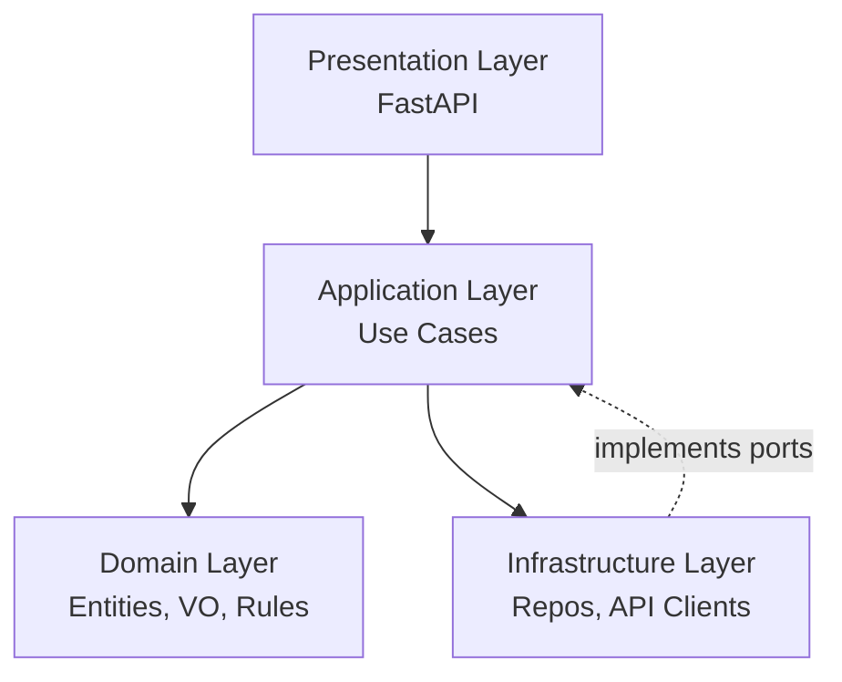

# JobAI — Architecture Technique

Ce document décrit la structure technique officielle du projet **JobAI Platform**, basée sur l’Architecture Hexagonale (Ports & Adapters), le Domain-Driven Design et le TDD.

---

## 🎯 Objectifs de l’architecture
- Avoir un Domain totalement indépendant des frameworks.
- Rendre la persistance interchangeable.
- Faciliter les tests unitaires et d’intégration.
- Permettre l’évolution sans dette technique.

---

# 🧱 Les 4 couches

## 1️⃣ Domain Layer (cœur métier)
Contient uniquement :
- Entités
- Value Objects
- Domain Services
- Règles métier

**Aucune dépendance externe.**

Le Domain ne connaît :
- ni SQLAlchemy
- ni FastAPI
- ni DTO
- ni Pydantic
- ni logs infra

---

## 2️⃣ Application Layer (use cases)
- Orchestration des actions métier
- Ports/interfaces
- Communication Domain ↔ Infrastructure

Règles :
- Aucun accès direct à la base de données
- Aucun import depuis infrastructure
- Un use case = une intention unique

---

## 3️⃣ Infrastructure Layer
Implémente :
- Repositories
- Clients API externes (Google, Stripe…)
- Services de mail
- Queue workers

Règles :
- Dépend de Application (ports)
- Peut dépendre de libs externes (SQLAlchemy, requests…)

---

## 4️⃣ Presentation Layer
- FastAPI endpoints
- DTOs / Pydantic models
- Webhooks et controllers

Règles :
- Pas de logique métier
- Mapping Request → Use Case → Response

---

## 📁 Structure du dépôt

```bash
app/
├── domain/
│   └── users/
│       ├── entities.py
│       ├── value_objects.py
│       └── domain_services.py
├── application/
│   └── users/
│       ├── use_cases.py
│       └── ports.py
├── infrastructure/
│   ├── persistence/
│   │   ├── models/
│   │   └── repositories/
│   └── external/
├── presentation/
│   ├── api/
│   │   └── v1/
│   └── schemas/
tests/
```

---

## 🔄 Flux d’exécution

```pgsql
Client HTTP
    ↓
Presentation (FastAPI)
    ↓  map DTO → input
Application (Use Case)
    ↓  via Port Interface
Infrastructure (Repository)
    ↓
Domain (Rules, Entities)
    ↑
Response Use Case → DTO → JSON
```

---

## 📐 Diagramme Mermaid


---

## ✔ Règles à respecter

- Domain doit pouvoir être extrait dans une librairie séparée.
- Aucun code métier dans les routes.
- Ports obligatoires pour toute dépendance externe.
- Repositories interchangeables facilement.

---

## 🧪 Tests

- Domain : tests unitaires purs
- Use cases : tests unitaires avec mocks
- Infrastructure : tests d’intégration
- End-to-end : tests via FastAPI TestClient

---

## 🔮 Évolutions futures

- CQRS (optionnel)
- Event sourcing pour SearchAgent
- Agents autonomes orchestrés par LLM

```yaml

---

# ✅ 3) `ONBOARDING.md` (COMPLET)

```md
# JobAI — Guide d’Onboarding Technique

Bienvenue dans l’équipe JobAI !
Ce document te guide pour commencer à travailler efficacement sur le projet.

---

## 🎯 Objectifs de l’onboarding
- Installer le projet rapidement
- Comprendre l’architecture Hexagonale + DDD
- Maîtriser le workflow TDD
- Savoir où coder et comment

---

# 🚀 Installation du projet

## 1️⃣ Prérequis
- Python 3.11+
- Poetry
- Docker & docker-compose
- PostgreSQL

---

## 2️⃣ Setup du projet

```bash
poetry install
cp .env.example .env
docker-compose up -d
poetry run alembic upgrade head
poetry run uvicorn app.main:app --reload

```


---

## 📚 Ressources
- [Architecture Hexagonale (Alistair Cockburn)](https://alistair.cockburn.us/hexagonal-architecture/)
- [Domain-Driven Design (Eric Evans)](https://domainlanguage.com/ddd/)
- [TDD (Kent Beck)](https://www.amazon.com/Test-Driven-Development-Kent-Beck/dp/0321146530)
- [Clean Architecture (Robert C. Martin)](https://www.amazon.com/Clean-Architecture-Craftsmans-Software-Structure/dp/0134494164)
