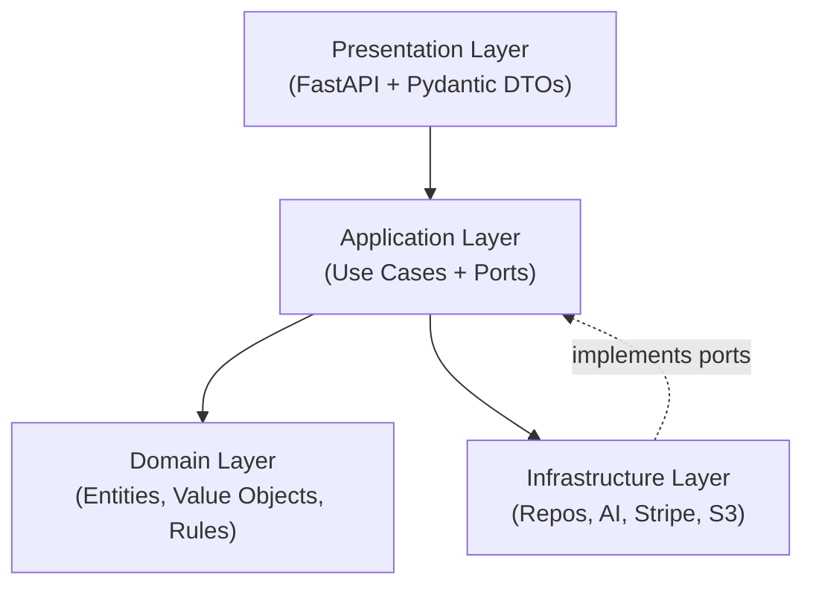

# Notion Documentation Structure — Implementation Plan

> **For agentic workers:** REQUIRED SUB-SKILL: Use superpowers:subagent-driven-development (recommended) or superpowers:executing-plans to implement this plan task-by-task. Steps use checkbox (`- [ ]`) syntax for tracking.

**Goal:** Create the full JobAI documentation workspace in Notion — a root page with two wings: 🚀 Product & Business (FR) and ⚙️ Engineering (EN).

**Architecture:** All pages created via Notion MCP (`notion-create-pages`). Root page first, then each wing, then leaf pages. No code involved — each task is a Notion API call with real page content.

**Tech Stack:** Notion MCP (`mcp__claude_ai_Notion__notion-create-pages`), Notion-flavored Markdown

---

## Task 1: Create root page "📦 JobAI Platform"

**Pages:** Create 1 workspace-level page (no parent)

- [ ] **Step 1: Create the root page**

Call `notion-create-pages` with no parent (workspace-level):

```
title: "📦 JobAI Platform"
icon: "📦"
content:
```

```markdown
<callout icon="🎯" color="blue_bg">
	**JobAI** est une plateforme d'automatisation intelligente pour la recherche d'emploi — matching IA candidat/offre, agents autonomes, scoring multi-dimensionnel et gestion de profil.
	Architecture Hexagonale · DDD · TDD · FastAPI · Python 3.13
</callout>

<columns>
	<column>
		## 🚀 Product & Business
		Vision produit, roadmap, fonctionnalités, personas et métriques.
		→ Pour comprendre **ce que fait** JobAI et **pour qui**.
	</column>
	<column>
		## ⚙️ Engineering
		Architecture, design specs, bounded contexts, onboarding et sécurité.
		→ Pour comprendre **comment** JobAI est construit.
	</column>
</columns>

---

## Quick Facts

<table header-row="true">
	<tr>
		<td>**Stack**</td>
		<td>Python 3.13 · FastAPI · PostgreSQL · LangGraph · Ollama</td>
	</tr>
	<tr>
		<td>**Architecture**</td>
		<td>Hexagonal (Ports & Adapters) · DDD · TDD First</td>
	</tr>
	<tr>
		<td>**AI**</td>
		<td>100% on-premise (Ollama + Mistral) · nLPD/RGPD compliant</td>
	</tr>
	<tr>
		<td>**Status**</td>
		<td>MVP — en développement actif</td>
	</tr>
	<tr>
		<td>**Repo**</td>
		<td>[github.com/rchsantos/jobai-backend-api](https://github.com/rchsantos/jobai-backend-api)</td>
	</tr>
</table>
```

- [ ] **Step 2: Note the page ID** — save the returned `id` for use as parent in Task 2 and Task 4.

---

## Task 2: Create "🚀 Product & Business" wing

**Parent:** root page ID from Task 1

- [ ] **Step 1: Create the Product & Business section page**

```
title: "🚀 Product & Business"
icon: "🚀"
content:
```

```markdown
> Documentation produit et business de la plateforme JobAI. Rédigée en français pour les stakeholders, investisseurs et co-fondateurs.

---

## Sections

- **📋 Vision & Positionnement** — Pitch, problème, solution, marché cible, roadmap
- **🎯 Fonctionnalités** — Description des features par bounded context
- **👤 Utilisateurs & Personas** — Profils des utilisateurs cibles
- **📊 Métriques & OKRs** — KPIs et objectifs par phase
```

- [ ] **Step 2: Note the page ID** — save for child pages in Task 3.

---

## Task 3: Create Product & Business child pages

**Parent:** "🚀 Product & Business" page ID from Task 2

- [ ] **Step 1: Create "📋 Vision & Positionnement"**

```
title: "📋 Vision & Positionnement"
icon: "📋"
content:
```

```markdown
> Vue d'ensemble de la vision produit, du positionnement marché et de la roadmap.

---

<page url="">Qu'est-ce que JobAI ?</page>
<page url="">Problème & Solution</page>
<page url="">Marché cible</page>
<page url="">Roadmap Produit</page>
```

Note: these sub-pages are created in the next steps. For now create the Vision container page first.

- [ ] **Step 2: Create "Qu'est-ce que JobAI ?" under Vision & Positionnement**

```
title: "Qu'est-ce que JobAI ?"
icon: "💡"
content:
```

```markdown
<callout icon="💡" color="blue_bg">
	**JobAI** est une plateforme SaaS qui automatise et optimise la recherche d'emploi grâce à l'intelligence artificielle — tout en gardant les données des utilisateurs 100% privées et conformes au RGPD/nLPD.
</callout>

## Le produit en une phrase

> JobAI connecte les candidats aux meilleures offres d'emploi grâce à des agents autonomes et un scoring IA multi-dimensionnel — sans jamais exposer leurs données à des services externes.

---

## Ce que fait JobAI

<table header-row="true">
	<tr>
		<td>**Feature**</td>
		<td>**Description**</td>
		<td>**Valeur**</td>
	</tr>
	<tr>
		<td>AI Matching & Scoring</td>
		<td>Score de compatibilité candidat/offre sur 4 dimensions (compétences, expérience, localisation, salaire)</td>
		<td>Candidatures mieux ciblées, moins de temps perdu</td>
	</tr>
	<tr>
		<td>SearchAgent autonome</td>
		<td>Agent IA qui recherche des offres pertinentes en continu sur le web</td>
		<td>Zéro effort de veille pour le candidat</td>
	</tr>
	<tr>
		<td>Gestion de profil & CV</td>
		<td>Upload CV, extraction automatique des compétences, profil structuré</td>
		<td>Un seul profil, utilisé partout</td>
	</tr>
	<tr>
		<td>Billing & Abonnements</td>
		<td>Plans Candidat et BusinessAccount via Stripe</td>
		<td>Modèle SaaS scalable</td>
	</tr>
</table>

---

## Proposition de valeur unique

- **100% on-premise AI** — toute l'inférence tourne en local (Ollama + Mistral). Aucune donnée PII ne quitte le serveur.
- **Conformité nLPD/RGPD by design** — pas un patch, c'est l'architecture elle-même.
- **Multi-dimensionnel** — le scoring va au-delà des mots-clés : il comprend l'expérience, la localisation, et les attentes salariales.
```

- [ ] **Step 3: Create "Problème & Solution" under Vision & Positionnement**

```
title: "Problème & Solution"
icon: "🎯"
content:
```

```markdown
## Le problème

La recherche d'emploi est **chronophage, répétitive et peu personnalisée**.

- Les candidats passent des heures à lire des offres inadaptées
- Les outils existants font du matching par mots-clés — superficiel et bruyant
- Les données des candidats sont partagées avec des dizaines de services tiers
- Aucune plateforme n'automatise vraiment la veille et la sélection

---

## La solution JobAI

<columns>
	<column>
		### Pour les candidats
		- Un agent autonome qui cherche en continu
		- Un score IA qui explique *pourquoi* une offre matche
		- Un profil unique, enrichi automatiquement depuis le CV
		- Données 100% privées — on-premise par design
	</column>
	<column>
		### Pour les entreprises *(BusinessAccount)*
		- Accès à une pool de candidats pré-scorés
		- Intégration Google My Business pour les avis
		- Billing et plans Stripe intégrés
	</column>
</columns>

---

## Pourquoi maintenant ?

- Les LLMs open-source (Mistral, LLaMA) atteignent la qualité GPT-4 pour ce type de tâches
- Les entreprises suisses sont sous pression RGPD/nLPD — un avantage compétitif fort
- Le marché de l'emploi tech en Suisse est en tension — les bons candidats ont besoin d'outils meilleurs
```

- [ ] **Step 4: Create "Marché cible" under Vision & Positionnement**

```
title: "Marché cible"
icon: "🌍"
content:
```

```markdown
## Segments cibles

### 🧑‍💻 Candidats (B2C)
Professionnels tech et non-tech en recherche active ou passive d'emploi.

**Profil prioritaire :**
- Développeurs, data scientists, ingénieurs
- Marché suisse romand et francophone (France, Belgique)
- Sensibles à la confidentialité des données

### 🏢 BusinessAccounts (B2B)
Entreprises qui recrutent et veulent accéder à une pool de candidats qualifiés.

**Profil prioritaire :**
- PME tech suisses
- Startups en hypercroissance
- Cabinets de recrutement

---

## Géographie phase 1

Suisse romande → France → Belgique → Europe francophone
```

- [ ] **Step 5: Create "Roadmap Produit" under Vision & Positionnement**

```
title: "Roadmap Produit"
icon: "🗺️"
content:
```

```markdown
<callout icon="📌" color="yellow_bg">
	La roadmap détaillée est gérée dans **Linear**. Cette page donne la vue stratégique par phase.
</callout>

## Phases

<table header-row="true">
	<tr>
		<td>**Phase**</td>
		<td>**Objectif**</td>
		<td>**Features clés**</td>
		<td>**Status**</td>
	</tr>
	<tr>
		<td>MVP</td>
		<td>Plateforme fonctionnelle avec AI matching</td>
		<td>Auth, Profil candidat, Upload CV, AI Matching (JOB-32), SearchAgent, Billing</td>
		<td>🔄 En cours</td>
	</tr>
	<tr>
		<td>Launch</td>
		<td>Premiers utilisateurs réels, feedback loop</td>
		<td>BusinessAccount, Google My Business, notifications, dashboard</td>
		<td>⏳ Planifié</td>
	</tr>
	<tr>
		<td>Funding</td>
		<td>Métriques de croissance, pitch investisseurs</td>
		<td>Analytics, multi-langue, mobile, API publique</td>
		<td>⏳ Futur</td>
	</tr>
</table>
```

- [ ] **Step 6: Create "🎯 Fonctionnalités" under Product & Business**

```
title: "🎯 Fonctionnalités"
icon: "🎯"
content:
```

```markdown
> Description des fonctionnalités par bounded context. Chaque section correspond à un contexte métier implémenté dans le backend.

---

## Vue d'ensemble

<table header-row="true">
	<tr>
		<td>**Bounded Context**</td>
		<td>**Feature principale**</td>
		<td>**Status**</td>
	</tr>
	<tr>
		<td>Users & Auth</td>
		<td>Inscription, connexion, JWT, OAuth Google</td>
		<td>✅ Implémenté</td>
	</tr>
	<tr>
		<td>Job Search</td>
		<td>JobPosting, Application, SearchAgent autonome</td>
		<td>✅ Implémenté</td>
	</tr>
	<tr>
		<td>AI Analysis</td>
		<td>Matching score IA 4 dimensions + explication NL</td>
		<td>🔄 JOB-32 en cours</td>
	</tr>
	<tr>
		<td>Storage</td>
		<td>Upload/delete CV via S3/MinIO</td>
		<td>✅ Implémenté</td>
	</tr>
	<tr>
		<td>Billing</td>
		<td>Abonnements Stripe, plans Candidat/Business</td>
		<td>✅ Implémenté</td>
	</tr>
</table>

---

## AI Matching & Scoring

Le cœur de valeur de JobAI. Étant donné un `CandidateProfile` et un `JobPosting`, le système calcule un `MatchScore` (0.0–1.0) sur 4 dimensions avec une explication en langage naturel.

**Dimensions scorées :**
- Compétences (skills match)
- Expérience (years + seniority)
- Localisation (remote / on-site / hybrid)
- Salaire (fourchette attendue vs. proposée)

**Architecture IA :**
- LangGraph DAG (5 nœuds, retry logic)
- Modèles Mistral (7B → 12B → 22B selon le tier)
- 100% on-premise via Ollama
- Observabilité via Langfuse self-hosted

---

## SearchAgent autonome

Agent IA qui recherche des offres pertinentes en continu pour un candidat, sans intervention manuelle.

- Scraping intelligent avec décodage URL LinkedIn
- Filtres configurables (localisation, salaire, type de contrat)
- Résultats stockés comme `JobPosting` dans la plateforme
- Score IA calculé automatiquement à chaque nouvelle offre trouvée

---

## Gestion de profil & CV

- Upload de CV en PDF/DOCX vers S3/MinIO
- Profil structuré : compétences, expériences, formation, attentes salariales
- Extraction automatique des données du CV par l'IA
- Indexation vectorielle pour le matching sémantique

---

## Billing & Abonnements

- Intégration Stripe (webhooks, plans, invoices)
- Plans **Candidat** : gratuit / premium
- Plans **BusinessAccount** : accès pool candidats, nombre de recherches
```

- [ ] **Step 7: Create "👤 Utilisateurs & Personas" under Product & Business**

```
title: "👤 Utilisateurs & Personas"
icon: "👤"
content:
```

```markdown
## Persona — Candidat

<callout icon="🧑‍💻" color="blue_bg">
	**Thomas, 32 ans — Développeur Backend**
	Cherche un nouveau poste à Genève ou en remote. Passé beaucoup de temps à lire des offres inadaptées. Très sensible à la confidentialité de ses données après avoir lu des articles sur le RGPD.
</callout>

**Motivations :**
- Trouver rapidement des offres pertinentes sans effort
- Comprendre *pourquoi* une offre matche son profil
- Ne pas partager ses données avec des tiers

**Frustrations actuelles :**
- Les plateformes classiques font du keyword matching superficiel
- Il reçoit des offres hors-sujet (stack différente, localisation inadaptée)
- Il ne sait pas comment son CV est évalué

---

## Persona — BusinessAccount

<callout icon="🏢" color="green_bg">
	**Sarah, Head of Talent — Startup tech de 50 personnes à Lausanne**
	Recrute 3–4 développeurs par an. Manque de temps pour trier les CVs. Veut accéder à des candidats pré-qualifiés avec un score de compatibilité.
</callout>

**Motivations :**
- Réduire le temps de tri des candidatures
- Accéder à des candidats déjà scorés sur ses critères
- Avoir une vue claire sur la compatibilité avant le premier entretien

**Frustrations actuelles :**
- Trop de CVs à lire pour pas grand chose
- Les plateformes classiques ne filtrent pas selon les critères techniques réels
```

- [ ] **Step 8: Create "📊 Métriques & OKRs" under Product & Business**

```
title: "📊 Métriques & OKRs"
icon: "📊"
content:
```

```markdown
<callout icon="⏳" color="yellow_bg">
	**Phase MVP** — Les métriques seront renseignées à partir du lancement des premiers utilisateurs réels.
</callout>

## KPIs produit

<table header-row="true">
	<tr>
		<td>**KPI**</td>
		<td>**Définition**</td>
		<td>**Cible MVP**</td>
		<td>**Cible Launch**</td>
	</tr>
	<tr>
		<td>Candidats actifs</td>
		<td>Candidats avec au moins 1 analyse IA</td>
		<td>—</td>
		<td>100</td>
	</tr>
	<tr>
		<td>Précision matching</td>
		<td>% d'analyses notées "pertinentes" par les candidats</td>
		<td>>70%</td>
		<td>>85%</td>
	</tr>
	<tr>
		<td>Latence analyse</td>
		<td>Temps moyen pour un MatchScore BALANCED</td>
		<td><20s</td>
		<td><15s</td>
	</tr>
	<tr>
		<td>Rétention 30j</td>
		<td>% de candidats toujours actifs à J+30</td>
		<td>—</td>
		<td>>40%</td>
	</tr>
	<tr>
		<td>MRR</td>
		<td>Monthly Recurring Revenue</td>
		<td>—</td>
		<td>CHF 1 000</td>
	</tr>
</table>

---

## OKRs par phase

### Phase MVP
- **O:** Livrer une plateforme IA fonctionnelle et testée
- **KR1:** Tous les bounded contexts implémentés avec TDD (coverage >90%)
- **KR2:** AI Analysis (JOB-32) déployé et opérationnel en local
- **KR3:** Zéro PII envoyé à un service externe

### Phase Launch
- **O:** Acquérir les 100 premiers candidats actifs
- **KR1:** Matching score évalué positivement par >70% des utilisateurs
- **KR2:** SearchAgent trouve en moyenne >10 offres/semaine/candidat
- **KR3:** Churn <30% à J+30

### Phase Funding
- **O:** Démontrer la traction pour un seed round
- **KR1:** MRR > CHF 5 000
- **KR2:** NPS > 40
- **KR3:** 3 BusinessAccounts pilotes signés
```

---

## Task 4: Create "⚙️ Engineering" wing

**Parent:** root page ID from Task 1

- [ ] **Step 1: Create the Engineering section page**

```
title: "⚙️ Engineering"
icon: "⚙️"
content:
```

```markdown
> Technical documentation for the JobAI backend platform. Written in English for developers, contributors, and future team members.

---

## Sections

- **🏗️ Architecture** — Hexagonal + DDD overview, bounded contexts, layer rules, ADR log
- **📐 Design Specs** — Approved design specs per feature/ticket
- **🧩 Bounded Contexts** — Per-context entities, ports, use cases, decisions
- **🧪 Testing Strategy** — TDD workflow, test structure, fakes vs mocks
- **🚀 Developer Onboarding** — Local setup, git workflow, code style
- **🔒 Security & Compliance** — RGPD/nLPD, auth, secrets
```

- [ ] **Step 2: Note the page ID** — save for child pages in Task 5.

---

## Task 5: Create Engineering child pages

**Parent:** "⚙️ Engineering" page ID from Task 4

- [ ] **Step 1: Create "🏗️ Architecture" page**

```
title: "🏗️ Architecture"
icon: "🏗️"
content:
```

```markdown
<table_of_contents/>

---

## Overview

JobAI uses **Hexagonal Architecture (Ports & Adapters)** combined with **Domain-Driven Design**. The goal: a domain that can be extracted into a standalone library, infrastructure that is fully swappable, and routes with zero business logic.



---

## The 4 Layers

<table header-row="true" header-column="true">
	<tr>
		<td>**Layer**</td>
		<td>**Location**</td>
		<td>**Responsibility**</td>
		<td>**Can import**</td>
	</tr>
	<tr>
		<td>Domain</td>
		<td>`app/domain/`</td>
		<td>Entities, Value Objects, domain rules</td>
		<td>stdlib only</td>
	</tr>
	<tr>
		<td>Application</td>
		<td>`app/application/`</td>
		<td>Use cases, abstract ports (ABC)</td>
		<td>`domain/` only</td>
	</tr>
	<tr>
		<td>Infrastructure</td>
		<td>`app/infrastructure/`</td>
		<td>SQLAlchemy repos, Ollama, Stripe, S3</td>
		<td>`domain/`, `application/`, external libs</td>
	</tr>
	<tr>
		<td>Presentation</td>
		<td>`app/presentation/`</td>
		<td>FastAPI routes, Pydantic DTOs</td>
		<td>`application/`, Pydantic, FastAPI</td>
	</tr>
</table>

---

## Bounded Contexts

<table header-row="true">
	<tr>
		<td>**Context**</td>
		<td>**Domain path**</td>
		<td>**Description**</td>
	</tr>
	<tr>
		<td>Users & Auth</td>
		<td>`domain/users/`</td>
		<td>Registration, login, JWT, OAuth Google</td>
	</tr>
	<tr>
		<td>Job Search</td>
		<td>`domain/job_search/`</td>
		<td>JobPosting, Application, SearchAgent</td>
	</tr>
	<tr>
		<td>AI Analysis</td>
		<td>`domain/ai_analysis/`</td>
		<td>LangGraph DAG, Ollama, matching score, RAG</td>
	</tr>
	<tr>
		<td>Billing</td>
		<td>`domain/billing/`</td>
		<td>Subscriptions, Stripe webhooks</td>
	</tr>
	<tr>
		<td>Storage</td>
		<td>`application/storage/`</td>
		<td>CV upload/delete via S3/MinIO</td>
	</tr>
</table>

---

## Tech Stack

<table header-row="true">
	<tr>
		<td>**Concern**</td>
		<td>**Choice**</td>
		<td>**Rationale**</td>
	</tr>
	<tr>
		<td>Web framework</td>
		<td>FastAPI</td>
		<td>Async-first, type-safe, OpenAPI out of the box</td>
	</tr>
	<tr>
		<td>ORM</td>
		<td>SQLAlchemy 2.0 (async)</td>
		<td>Mature, Mapped[] types, async sessions</td>
	</tr>
	<tr>
		<td>Database</td>
		<td>PostgreSQL + TimescaleDB + pgvectorscale</td>
		<td>Single DB for relational + vector search</td>
	</tr>
	<tr>
		<td>AI orchestration</td>
		<td>LangGraph</td>
		<td>Stateful DAG, conditional retry, prod-ready</td>
	</tr>
	<tr>
		<td>LLM inference</td>
		<td>Ollama (Mistral 7B/12B/22B)</td>
		<td>100% on-premise, zero data exfiltration</td>
	</tr>
	<tr>
		<td>Observability</td>
		<td>Langfuse self-hosted</td>
		<td>LLM-native tracing, RGPD compliant</td>
	</tr>
	<tr>
		<td>Billing</td>
		<td>Stripe</td>
		<td>Industry standard, webhook-driven</td>
	</tr>
	<tr>
		<td>File storage</td>
		<td>S3 / MinIO</td>
		<td>S3-compatible, self-hosted option</td>
	</tr>
	<tr>
		<td>Testing</td>
		<td>pytest + pytest-asyncio</td>
		<td>Async-native, strict mode, fixtures</td>
	</tr>
</table>

---

## ADR Log

<table header-row="true">
	<tr>
		<td>**#**</td>
		<td>**Decision**</td>
		<td>**Rationale**</td>
		<td>**Alternatives rejected**</td>
	</tr>
	<tr>
		<td>ADR-001</td>
		<td>Ollama for LLM inference (no OpenAI)</td>
		<td>nLPD/RGPD compliance, zero cost per call</td>
		<td>OpenAI API, Anthropic API</td>
	</tr>
	<tr>
		<td>ADR-002</td>
		<td>TimescaleDB + pgvectorscale for vector store</td>
		<td>No new infra — extends existing Postgres</td>
		<td>Pinecone, Weaviate, Qdrant</td>
	</tr>
	<tr>
		<td>ADR-003</td>
		<td>LangGraph over LangChain chains</td>
		<td>Stateful DAG with retry logic, prod-ready from day one</td>
		<td>LangChain sequential chains, raw Python</td>
	</tr>
	<tr>
		<td>ADR-004</td>
		<td>FastAPI BackgroundTasks for async AI jobs (MVP)</td>
		<td>Zero extra infra, swappable to Celery via adapter</td>
		<td>Celery + Redis, ARQ</td>
	</tr>
	<tr>
		<td>ADR-005</td>
		<td>Fakes over Mocks in domain/application tests</td>
		<td>In-memory implementations test real contracts, not call signatures</td>
		<td>unittest.mock, MagicMock</td>
	</tr>
</table>
```

- [ ] **Step 2: Create "📐 Design Specs" page**

```
title: "📐 Design Specs"
icon: "📐"
content:
```

```markdown
> Approved design specs per feature ticket. Summaries only — full specs live in `docs/superpowers/specs/` in the git repository.

<callout icon="📌" color="gray_bg">
	**Source of truth:** `docs/superpowers/specs/` in the [backend-api repo](https://github.com/rchsantos/jobai-backend-api). Notion pages are readable summaries with links back to git.
</callout>

---

## JOB-32 — AI Analysis: Job/Profile Matching Score

**Branch:** `feature/job-32-ai-analysis-jobprofile-matching-score-with-langchain`
**Status:** ✅ Approved — implementation in progress

### What it builds
Given a `CandidateProfile` and a `JobPosting`, compute a structured `MatchScore` (0.0–1.0) across 4 dimensions with a natural language explanation. 100% on-premise inference via Ollama.

### Architecture
4-layer AI system integrated into the hexagonal architecture:
- **Agentic Layer:** LangGraph DAG (5 nodes, retry logic) — `profile_extractor → job_extractor → semantic_retriever → scorer → reporter`
- **MCP Layer:** 3 separate MCP servers (profile, jobs, vector)
- **Memory Layer:** TimescaleDB + pgvectorscale (HNSW index), embeddings pre-computed at upsert
- **Observability:** Langfuse self-hosted — full DAG tracing, PII sanitization, token tracking

### Quality Tiers
- **FAST** (~5s) — Mistral 7B
- **BALANCED** (~15s) — Mistral-nemo 12B *(default)*
- **PRECISE** (~45s) — Mistral 22B

### Key endpoints
- `POST /api/v1/analyses/` — hybrid cache: 200 (hit) or 202 + Location header (async)
- `GET /api/v1/analyses/{id}` — polling
- `GET /api/v1/candidates/{id}/job-matches/?top_k=20` — RAG top-K

**Full spec:** `docs/superpowers/specs/2026-05-07-ai-analysis-langgraph-rag-design.md`
```

- [ ] **Step 3: Create "🧩 Bounded Contexts" page**

```
title: "🧩 Bounded Contexts"
icon: "🧩"
content:
```

```markdown
> One page per bounded context — entities, ports, use cases, and key decisions.

---

## Ubiquitous Language

<table header-row="true">
	<tr>
		<td>**Term**</td>
		<td>**Definition**</td>
	</tr>
	<tr>
		<td>`Candidate`</td>
		<td>Job seeker registered on the platform</td>
	</tr>
	<tr>
		<td>`JobPosting`</td>
		<td>Job offer, scraped or manually entered</td>
	</tr>
	<tr>
		<td>`Application`</td>
		<td>A Candidate's submission to a JobPosting</td>
	</tr>
	<tr>
		<td>`SearchAgent`</td>
		<td>Autonomous AI agent that searches jobs for a Candidate</td>
	</tr>
	<tr>
		<td>`BusinessAccount`</td>
		<td>Company connected to the platform</td>
	</tr>
	<tr>
		<td>`MatchScore`</td>
		<td>AI-computed compatibility score (0.0–1.0) across 4 dimensions</td>
	</tr>
	<tr>
		<td>`AIAnalysis`</td>
		<td>AI-generated content — summary, matching, scoring</td>
	</tr>
	<tr>
		<td>`Subscription`</td>
		<td>Billing plan for Candidate or BusinessAccount</td>
	</tr>
</table>

---

## Users & Auth

**Entities:** `User`, `Candidate`, `BusinessAccount`
**Value Objects:** `Email`, `HashedPassword`
**Use cases:** `RegisterCandidateUseCase`, `LoginUseCase`, `RefreshTokenUseCase`, `OAuthGoogleUseCase`
**Key decision:** JWT-based auth, short-lived access tokens + refresh tokens

---

## Job Search

**Entities:** `JobPosting`, `Application`, `SearchAgent`
**Value Objects:** `JobTitle`, `SalaryRange`, `Location`
**Use cases:** `CreateSearchAgentUseCase`, `RunSearchAgentUseCase`, `ApplyToJobUseCase`
**Key decision:** LinkedIn URL safety decoding to prevent tracking redirects

---

## AI Analysis

**Entities:** `AIAnalysis`
**Value Objects:** `MatchScore` (overall, skills, experience, location, salary, explanation)
**Enums:** `AnalysisStatus` (PENDING/PROCESSING/COMPLETED/FAILED), `AnalysisQualityTier` (FAST/BALANCED/PRECISE)
**Use cases:** `ComputeMatchScoreUseCase`, `GetAnalysisUseCase`, `IndexCandidateProfileUseCase`, `IndexJobPostingUseCase`, `GetCandidateJobMatchesUseCase`
**Key decision:** Hybrid cache — reuse completed analysis, reset failed ones (UPDATE not INSERT)

---

## Billing

**Entities:** `Subscription`
**Value Objects:** `Money`, `PlanType`
**Use cases:** `CreateSubscriptionUseCase`, `CancelSubscriptionUseCase`, `HandleStripeWebhookUseCase`
**Key decision:** Stripe webhooks drive subscription state, never direct API polling

---

## Storage

**Ports:** `FileStorageGateway` (upload, delete, get_url)
**Adapters:** `S3FileStorageGateway` (boto3, S3-compatible)
**Use cases:** `UploadCVUseCase`, `DeleteCVUseCase`
**Key decision:** Infrastructure concern only — no domain entity for files
```

- [ ] **Step 4: Create "🧪 Testing Strategy" page**

```
title: "🧪 Testing Strategy"
icon: "🧪"
content:
```

```markdown
## TDD is mandatory

**Never write implementation before tests.** Order: domain → application → infrastructure → presentation.

---

## Test Structure

<table header-row="true">
	<tr>
		<td>**Layer**</td>
		<td>**Location**</td>
		<td>**Type**</td>
		<td>**DB?**</td>
		<td>**Key fixture**</td>
	</tr>
	<tr>
		<td>Domain</td>
		<td>`tests/domain/`</td>
		<td>Pure unit</td>
		<td>No</td>
		<td>None needed</td>
	</tr>
	<tr>
		<td>Application</td>
		<td>`tests/application/`</td>
		<td>Unit with Fakes</td>
		<td>No</td>
		<td>`tests/fakes/`</td>
	</tr>
	<tr>
		<td>Infrastructure</td>
		<td>`tests/infrastructure/`</td>
		<td>Integration</td>
		<td>Yes (auto-rollback)</td>
		<td>`db_session`</td>
	</tr>
	<tr>
		<td>Presentation</td>
		<td>`tests/presentation/`</td>
		<td>E2E (AsyncClient)</td>
		<td>Yes (overridden session)</td>
		<td>`client`</td>
	</tr>
</table>

---

## Fakes vs Mocks

**Rule: always use Fakes for domain/application tests. Never use `unittest.mock` there.**

- **Fakes** = in-memory implementations of ports (`InMemoryUserRepo`, `FakeEmbeddingPort`…). They test real contracts.
- **Mocks** = call-signature verification. They don't test actual behavior. Fine for infrastructure adapters where you want to verify an external call was made.

Fakes live in `tests/fakes/<context>/`.

---

## Naming Convention

```python
# Domain — pure, no mocks
def test_candidate_raises_when_email_invalid(): ...
def test_match_score_raises_when_score_out_of_bounds(): ...

# Application — Fakes
async def test_create_candidate_use_case_returns_candidate_entity(): ...
async def test_compute_match_score_use_case_returns_cached_analysis(): ...

# Presentation — client fixture
async def test_post_analyses_returns_202_new(): ...
async def test_post_analyses_returns_200_cached(): ...
```

---

## Running Tests

```bash
# All tests
poetry run pytest -q

# By layer
poetry run pytest tests/domain/ -q
poetry run pytest tests/application/ -q
poetry run pytest tests/infrastructure/ -q
poetry run pytest tests/presentation/ -q

# Single file
poetry run pytest tests/application/ai_analysis/test_compute_match_score_use_case.py -v
```
```

- [ ] **Step 5: Create "🚀 Developer Onboarding" page**

```
title: "🚀 Developer Onboarding"
icon: "🚀"
content:
```

```markdown
Welcome to JobAI. This page is everything you need to go from zero to productive.

---

## Prerequisites

- Python 3.13+
- [Poetry](https://python-poetry.org/)
- Docker & docker-compose
- PostgreSQL (via Docker)

---

## Local Setup

```bash
# 1. Install dependencies
poetry install

# 2. Copy and fill environment variables
cp .env.example .env

# 3. Start dev environment (PostgreSQL + app services)
docker-compose -f docker-compose.dev.yml up -d

# 4. Run migrations
poetry run alembic upgrade head

# 5. Start dev server (hot reload)
poetry run uvicorn app.main:app --reload
```

The API will be available at `http://localhost:8000`. Swagger UI at `http://localhost:8000/docs`.

---

## Key Environment Variables

<table header-row="true">
	<tr>
		<td>**Variable**</td>
		<td>**Purpose**</td>
	</tr>
	<tr>
		<td>`DATABASE_URL`</td>
		<td>PostgreSQL sync (Alembic migrations)</td>
	</tr>
	<tr>
		<td>`DATABASE_URL_TEST`</td>
		<td>PostgreSQL async (test suite)</td>
	</tr>
	<tr>
		<td>`JWT_SECRET`</td>
		<td>Token signing key</td>
	</tr>
	<tr>
		<td>`STRIPE_SECRET`</td>
		<td>Stripe API key</td>
	</tr>
	<tr>
		<td>`OPENAI_API_KEY`</td>
		<td>Legacy — AI features now use Ollama locally</td>
	</tr>
</table>

---

## Git Workflow

1. Branch from `develop`: `git checkout -b feature/job-XX-short-description`
2. TDD: write tests first, then implement
3. Run full test suite before PR: `poetry run pytest -q`
4. Lint: `poetry run ruff check . && poetry run black . && poetry run mypy .`
5. Open PR against `develop`

---

## PR Checklist

- [ ] Tests written first (TDD)
- [ ] All tests pass (`pytest -q`)
- [ ] No business logic in routes
- [ ] No SQLAlchemy imports in `domain/` or `application/`
- [ ] Linting clean (`ruff`, `black`, `mypy`)
- [ ] No HTTP status codes raised inside use cases

---

## Code Style

- Line length: **120 characters**
- Type hints required everywhere
- Entities: `@dataclass(slots=True)` (mutable)
- Value Objects: `@dataclass(frozen=True, slots=True)` (immutable)
- Comments: only when the WHY is non-obvious
- Ruff ALL rules except `D` (docstrings)
```

- [ ] **Step 6: Create "🔒 Security & Compliance" page**

```
title: "🔒 Security & Compliance"
icon: "🔒"
content:
```

```markdown
## RGPD / nLPD — On-Premise AI Strategy

JobAI's AI system is **100% on-premise by design** — not as a patch, but as an architectural decision.

<table header-row="true">
	<tr>
		<td>**Component**</td>
		<td>**Where it runs**</td>
		<td>**Why**</td>
	</tr>
	<tr>
		<td>LLM inference</td>
		<td>Ollama (local)</td>
		<td>Zero PII sent externally</td>
	</tr>
	<tr>
		<td>Vector store</td>
		<td>TimescaleDB + pgvectorscale (local)</td>
		<td>Embeddings never leave the server</td>
	</tr>
	<tr>
		<td>Observability</td>
		<td>Langfuse self-hosted</td>
		<td>LLM traces with PII sanitization middleware</td>
	</tr>
</table>

**PII sanitization:** A middleware strips email/phone from all Langfuse traces before export.

**Candidate data deletion:** Cascade delete on `candidates` → removes embeddings + analyses.

---

## Auth & JWT

- Access tokens: short-lived JWT (15 min), signed with `JWT_SECRET`
- Refresh tokens: longer-lived, stored in DB, rotated on use
- OAuth Google: token exchange via `OAuthGoogleUseCase`, no password stored
- MCP servers: internal JWT (signed, short-lived) — never exposed to public API

---

## Rate Limiting

- `slowapi` middleware: max **10 AI analyses / hour / candidate**
- Applied at presentation layer — use cases have no knowledge of rate limits

---

## Secrets Management

- All secrets in `.env` (never committed — gitignored)
- `.env.example` documents all required variables with placeholder values
- Production: secrets injected via environment variables (Docker / K8s secrets)
- No hardcoded credentials anywhere in the codebase
```

---

## Self-Review Checklist

- [x] **Spec coverage:** Root page ✓, Product wing (8 pages) ✓, Engineering wing (6 pages) ✓
- [x] **No placeholders:** All pages have real content
- [x] **Consistency:** Page titles match the design spec exactly
- [x] **Notion Markdown:** All content uses Notion-flavored Markdown (tables, callouts, columns, mermaid)
- [x] **Phased content:** MVP-phase pages are populated; future phases have stubs with callouts
